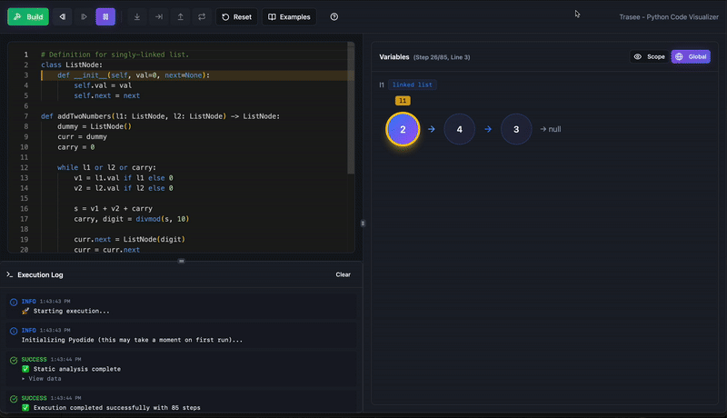

# 🔍 Trasee

**Trasee** is a browser-based Python code tracer and data structure visualizer designed to help you understand algorithms by watching them run step-by-step.

Unlike traditional debuggers, Trasee intelligently detects and visualizes common data structures (linked lists, trees, graphs, etc.) as your code executes, making it perfect for understanding LeetCode solutions and algorithm implementations.



## ✨ Features

- **🐍 In-Browser Python Execution** - Run Python code entirely in your browser using Pyodide
- **📊 Smart Data Structure Detection** - Automatically recognizes and visualizes:
  - Linked lists (via `.next` traversal)
  - Binary trees (via `.left`/`.right` nodes)
  - Graphs (adjacency lists)
  - Arrays, dictionaries, stacks, queues, and more
- **⏯️ Step-by-Step Execution** - Trace through code line-by-line with full playback controls
- **🎯 Variable Tracking** - See all variables and their values at each execution step
- **🎨 Beautiful Visualizations** - Interactive, draggable visualizations powered by React Flow
- **💡 Built for Learning** - Perfect for understanding algorithms, debugging logic, and studying LeetCode solutions

## 🎯 Use Cases

- **Algorithm Learning** - Visualize sorting algorithms, tree traversals, and graph searches
- **LeetCode Practice** - Understand how solutions work by watching them execute
- **Debugging** - Step through complex data structure manipulations
- **Teaching** - Demonstrate algorithms with clear, visual explanations

## 🚀 Getting Started

### Prerequisites

- Node.js 16+ and npm (or use [nvm](https://github.com/nvm-sh/nvm#installing-and-updating))

### Installation

```bash
# Clone the repository
git clone https://github.com/Ri-Hong/trasee.git
cd trasee

# Install dependencies
npm install

# Start the development server
npm run dev
```

The app will be available at `http://localhost:5173`

### Quick Start

1. **Paste your Python code** into the Monaco editor
2. **Click "Run"** to execute the code
3. **Use playback controls** to step through execution
4. **Watch visualizations** update as your code runs
5. **Inspect variables** in the variables panel

## 🧰 Tech Stack

### Frontend

- **React + TypeScript** - Modern UI development with type safety
- **Vite** - Fast build tool and dev server
- **Tailwind CSS + shadcn/ui** - Beautiful, accessible component library
- **Monaco Editor** - VS Code's editor in the browser

### Python Execution

- **Pyodide** - CPython compiled to WebAssembly
- **Web Workers** - Keeps execution off the main thread for smooth UI
- **sys.settrace** - Line-by-line execution tracking

### Visualization

- **React Flow** - Interactive node-based visualizations
- **Custom Renderers** - Specialized components for each data structure type
- **Zustand** - Lightweight state management for execution steps

### Analysis

- **Python AST** - Static analysis for variable detection
- **TypeScript Heuristics** - Runtime data structure inference

## 🔧 How It Works

### 1. Static Analysis

When you load code, Trasee parses it using Python's `ast` module to identify:

- Variable declarations and their scopes
- Function boundaries
- Data structure hints from type annotations

### 2. Execution Tracing

As your code runs, `sys.settrace` captures:

- Line-by-line execution flow
- Variable values at each step
- Object structures and references

### 3. Data Structure Detection

Trasee analyzes runtime values to infer higher-level structures:

```python
# If we see objects with .next → Linked List
# If we see objects with .left/.right → Binary Tree
# If we see dict with node keys → Graph
```

### 4. Visualization

Each detected structure gets its own specialized renderer:

- **LinkedListVisualizer** - Horizontal node chains
- **TreeVisualizer** - Hierarchical tree layout
- **GraphVisualizer** - Network graph with edges
- **ListVisualizer** - Array/list with indices
- **DictVisualizer** - Key-value tables

## 📝 Example

```python
# Definition for singly-linked list
class ListNode:
    def __init__(self, val=0, next=None):
        self.val = val
        self.next = next

def addTwoNumbers(l1: ListNode, l2: ListNode) -> ListNode:
    dummy = ListNode()
    curr = dummy
    carry = 0

    while l1 or l2 or carry:
        v1 = l1.val if l1 else 0
        v2 = l2.val if l2 else 0

        s = v1 + v2 + carry
        carry, digit = divmod(s, 10)

        curr.next = ListNode(digit)
        curr = curr.next

        l1 = l1.next if l1 else None
        l2 = l2.next if l2 else None

    return dummy.next
```

Trasee will:

1. Detect `l1`, `l2`, `dummy`, and `curr` as linked lists
2. Show visual linked list representations
3. Highlight changes as you step through
4. Display primitive values like `carry`, `v1`, `v2` in the variables panel

## 🏗️ Project Structure

```
trasee/
├── src/
│   ├── components/
│   │   ├── CodeEditor.tsx          # Monaco editor wrapper
│   │   ├── ControlPanel.tsx        # Playback controls
│   │   ├── VariablesPanel.tsx      # Variable state display
│   │   ├── VisualizationPanel.tsx  # Main visualization container
│   │   ├── visualizers/            # Data structure renderers
│   │   │   ├── ListVisualizer.tsx
│   │   │   ├── LinkedListVisualizer.tsx
│   │   │   ├── TreeVisualizer.tsx
│   │   │   ├── GraphVisualizer.tsx
│   │   │   └── ...
│   ├── lib/
│   │   ├── pyodideWorker.ts        # Python execution engine
│   │   ├── globalStateTracker.ts   # Variable tracking logic
│   │   ├── dataStructureDetector.ts # Type inference
│   ├── store/
│   │   └── executionStore.ts       # Zustand state management
│   └── pages/
│       └── Index.tsx               # Main application page
├── public/                          # Static assets
└── package.json
```

## 🛠️ Development

### Build Commands

```bash
# Development server with hot reload
npm run dev

# Production build
npm run build

# Preview production build
npm run preview

# Lint code
npm run lint
```

### Adding New Visualizers

1. Create a new component in `src/components/visualizers/`
2. Implement the visualizer interface with your rendering logic
3. Add detection logic in `src/lib/dataStructureDetector.ts`
4. Register the visualizer in `VisualizationPanel.tsx`

## 🚢 Deployment

Trasee is a fully static application with no backend required.

### Deploy to Vercel

```bash
npm run build
# Deploy the dist/ folder to Vercel
```

### Deploy to GitHub Pages

```bash
npm run build
# Push the dist/ folder to your gh-pages branch
```

## 🤝 Contributing

Contributions are welcome! Some areas for improvement:

- **More Visualizers** - Add support for heaps, tries, segment trees, etc.
- **Better Detection** - Improve data structure inference accuracy
- **Performance** - Optimize for larger code samples
- **Features** - Breakpoints, watch expressions, custom variable naming

## 📄 License

This project is open source and available under the MIT License.

## 🙏 Acknowledgments

- Inspired by [Python Tutor](https://pythontutor.com/)
- Built with [Pyodide](https://pyodide.org/)
- UI components from [shadcn/ui](https://ui.shadcn.com/)
- Visualizations powered by [React Flow](https://reactflow.dev/)

---

**Made with ❤️ for algorithm learners everywhere**
